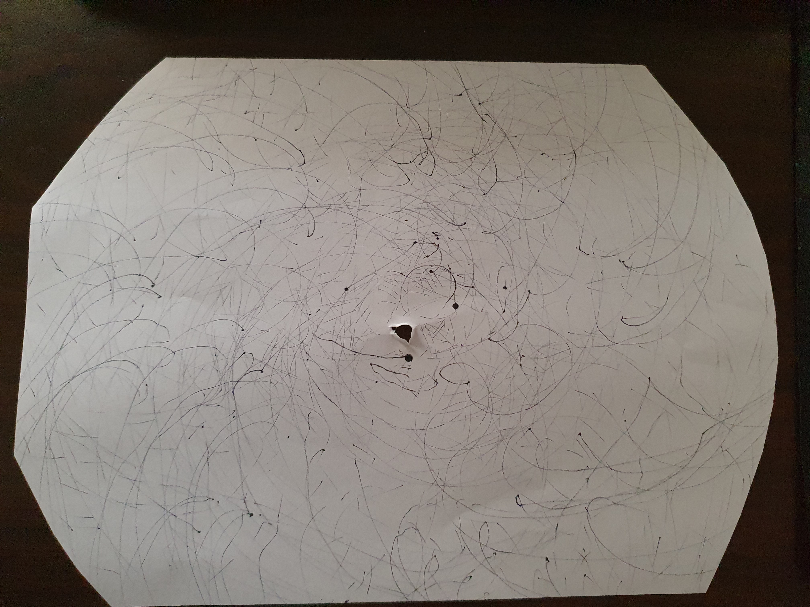

## Week 3

This week we started to have a look at machines, and the inputs, outputs and processes of these machines to create generative design. One of the activities that we did is creating our own drawing machine. I decided to utilise my vinyl player that I had, since I wanted a nice element of randomness, and using the spinning table as a canvas. On top of this I taped a piece of string to the ceiling and had it suspend a sharpie onto the canvas.  I let this run for about half an hour until the pen got stuck behind the arm of the vinyl player. I also tried to implement a fan to add some more variation but it kept pushing the sharpie off the canvas so I had to get rid of it. Looking back I should have tried adding another pen of a different colour or something like that to add some more colour and personality to it.

Heres the video: https://drive.google.com/file/d/1fWczFU4ZWbDQYdIAY2_ftaMzCGIiLs8Q/view?usp=sharing

Also this week Karen and Andy came and talked to us about our first ideas for our generative design. My initial idea is all centered around jazz and that’s what I want to focus on, since I love jazz and I think there's a lot of content I can use. For one I love the poetic simple titles that a lot of jazz artists seem to adhere to, titles such as: These Foolish Things (Remind Me Of You), and I Get Along Without You Very Well (Except Sometimes). I want to somehow incorporate that, I was thinking about maybe making randomly generated poems or artworks that are related to the titles. On top of that I also love the music so my initial idea is to have a random generator, or maybe a user input that will pick a couple songs and splice them together, creating a new title (once again with the poetics) and even an album art that relates to the spliced songs. Right now this is just an idea but it’s a good starting point I feel.
