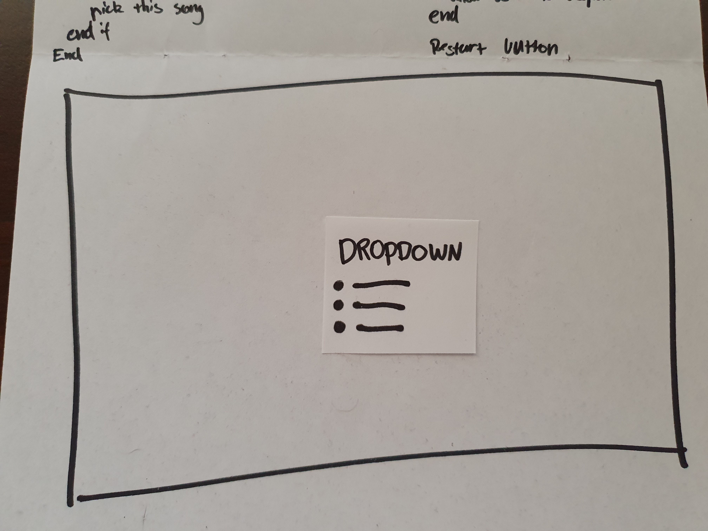
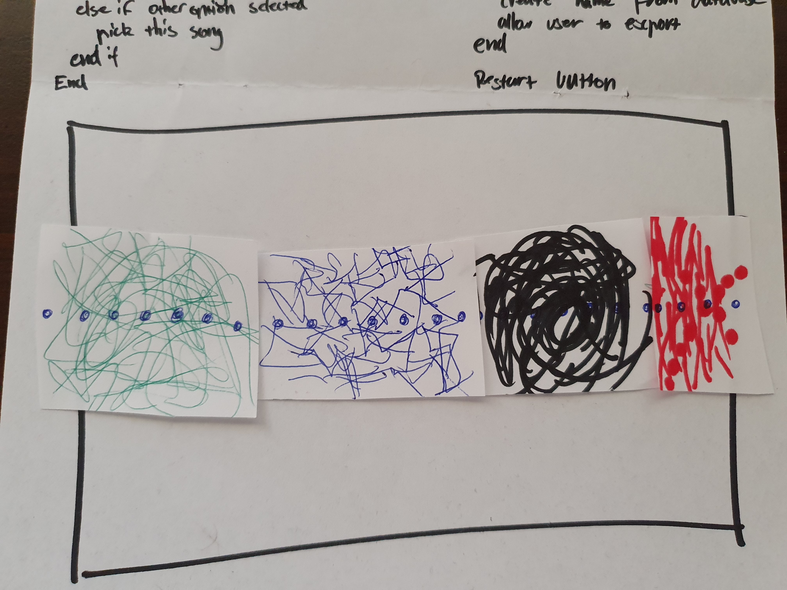
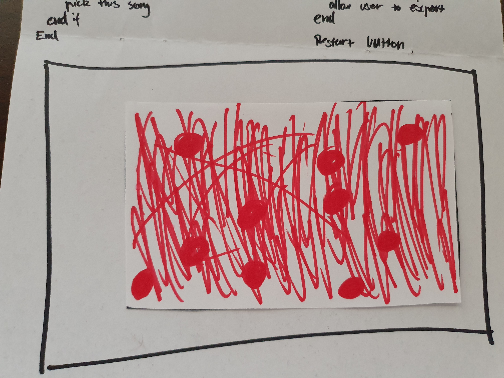
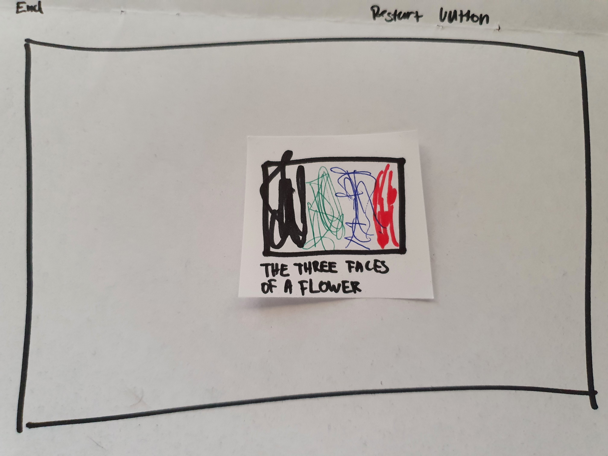

# Week 7

This week we further delved into our project and did a mini presentation of where we are at. So I've decided to continue this jazz theme and make a visualizer/unique song maker, still deciding how to start and end it. Regardless I know that I am going to be splicing jazz songs and creating generative art from it. Along with this I will sorting songs into keys, intrsuments and such and assigning each of these a different element such as shape and colour. 
With this I know I need to learn certain things with coding:
- Using sound libraries
- Using databases or MIDI libraries
- Generating random artwork
- Exporting said artwork

Along with this we had to write out pseudocode, now I did this before the class because I read the announcement so my pseudocode isn’t using completely correct language but it should make sense. Also I don’t know exactly everything I need yet or how to properly structure it, this is just what I think I will need. We also had to make a paper prototype so here it is. Also just a rough outline not quite sure what will be best/easiest for me.

Pseudocode

Dropdown menu as a start

The generative artwork being made

Can also fullscreen on the current portion(maybe)

Final artwork

Export feature

